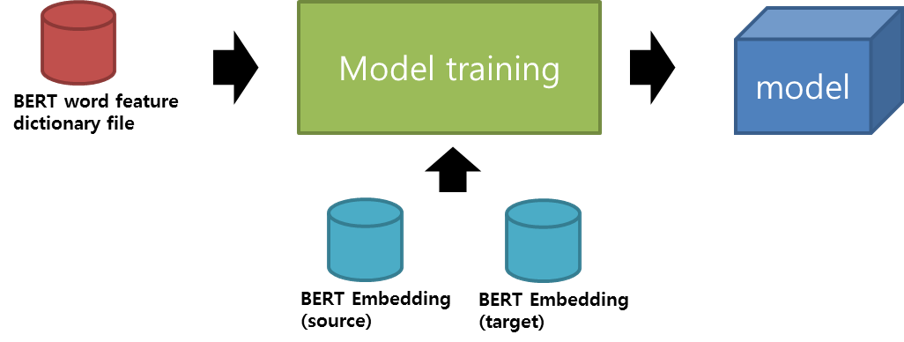

# OpenNMT-py: Open-Source Neural Machine Translation

[](https://travis-ci.org/OpenNMT/OpenNMT-py)
[](https://floydhub.com/run?template=https://github.com/OpenNMT/OpenNMT-py)

This is a [Pytorch](https://github.com/pytorch/pytorch)
port of [OpenNMT](https://github.com/OpenNMT/OpenNMT),
an open-source (MIT) neural machine translation system. It is designed to be research friendly to try out new ideas in translation, summary, image-to-text, morphology, and many other domains. Some companies have proven the code to be production ready.

We love contributions. Please consult the Issues page for any [Contributions Welcome](https://github.com/OpenNMT/OpenNMT-py/issues?q=is%3Aissue+is%3Aopen+label%3A%22contributions+welcome%22) tagged post. 

<center style="padding: 40px"></center>

Before raising an issue, make sure you read the requirements and the documentation examples.

Unless there is a bug, please use the [Forum](http://forum.opennmt.net) or [Gitter](https://gitter.im/OpenNMT/OpenNMT-py) to ask questions.

## Requirements

All dependencies can be installed via:

```bash
pip install -r requirements.txt
```

Note that we currently only support PyTorch 1.0.0

### Make embedding file for training
--Step 1 : tokenize
bert_tokenizer.py
```bash
python bert_tokenize.py [tokenize option] [language option] [input file]
```
결과 : input 파일의 bert tokenize된 형태의 파일 생성

```bash
Tokenize 예시
원문 - Source : Import Data from MED Files - Target : MED 파일에서 데이터 가져오기
BERT tokenize-  Source :  [CLS] I ##mpo ##rt Data from ME ##D Files [SEP] -  Target : [CLS] ME ##D 파 ##일 ##에서 데 ##이터 가 ##져 ##오 ##기 [SEP]
```
```bash
Tokenize옵션
bert_base_cased  (영어에서만 사용)
bert_base_multi_cased (영어를 제외한 외국어)
kobert_base_cased_bpe (한국어에서만 사용)

언어옵션
영어 – en 
영어는 꼭 en으로 명시해줘야 영어전용 BERT(google)모델로 할당
한국어
ko – BERT(google) 모델을 사용할 때
kobert – korbert(ETRI) 모델을 사용할 때
그 외
en, ko 그리고 kobert가 아닌 아무 문자나 넣으셔도 알아서 동작
이유 : 다른 외국어들은 모두 BERT(google)의 multi_cased 모델을 사용하기 때문
```

### Step 1: Preprocess the data

```bash
python preprocess.py -train_src data/src-train.txt -train_tgt data/tgt-train.txt -valid_src data/src-val.txt -valid_tgt data/tgt-val.txt -save_data data/demo
```

We will be working with some example data in `data/` folder.

The data consists of parallel source (`src`) and target (`tgt`) data containing one sentence per line with tokens separated by a space:

* `src-train.txt`
* `tgt-train.txt`
* `src-val.txt`
* `tgt-val.txt`

Validation files are required and used to evaluate the convergence of the training. It usually contains no more than 5000 sentences.


After running the preprocessing, the following files are generated:

* `demo.train.pt`: serialized PyTorch file containing training data
* `demo.valid.pt`: serialized PyTorch file containing validation data
* `demo.vocab.pt`: serialized PyTorch file containing vocabulary data


Internally the system never touches the words themselves, but uses these indices.

### Step 2: Train the model with using BERT

```bash
python train.py -data data/demo -save_model demo-model -pre_word_vecs_enc file1.pt -pre_word_vecs_dec file2.pt
```

The main train command is quite simple. Minimally it takes a data file
and a save file.  This will run the default model, which consists of a
2-layer LSTM with 500 hidden units on both the encoder/decoder.
If you want to train on GPU, you need to set, as an example:
CUDA_VISIBLE_DEVICES=1,3
`-world_size 2 -gpu_ranks 0 1` to use (say) GPU 1 and 3 on this node only.
To know more about distributed training on single or multi nodes, read the FAQ section.

★위에서 생성한 embedding 파일들 (.pt)를 옵션에 추가만 하면됩니다.

### Step 3: Translate

```bash
python translate.py -model demo-model_acc_XX.XX_ppl_XXX.XX_eX.pt -src data/src-test.txt -output pred.txt -replace_unk -verbose
```

Now you have a model which you can use to predict on new data. We do this by running beam search. This will output predictions into `pred.txt`.

!!! note "Note"
    The predictions are going to be quite terrible, as the demo dataset is small. Try running on some larger datasets! For example you can download millions of parallel sentences for [translation](http://www.statmt.org/wmt16/translation-task.html) or [summarization](https://github.com/harvardnlp/sent-summary).
    

## Alternative: Run on FloydHub

[](https://floydhub.com/run?template=https://github.com/OpenNMT/OpenNMT-py)

Click this button to open a Workspace on [FloydHub](https://www.floydhub.com/?utm_medium=readme&utm_source=opennmt-py&utm_campaign=jul_2018) for training/testing your code.


## Pretrained embeddings (e.g. GloVe)

Please see the FAQ: [How to use GloVe pre-trained embeddings in OpenNMT-py](http://opennmt.net/OpenNMT-py/FAQ.html#how-do-i-use-pretrained-embeddings-e-g-glove)

## Pretrained Models

The following pretrained models can be downloaded and used with translate.py.

http://opennmt.net/Models-py/

